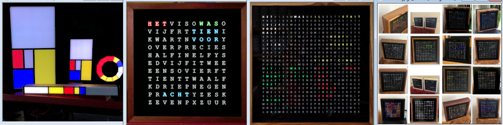

<h1 class="auto-style3">Word clock selector</h1>

There are several different designs of the word clock. This page gives an overview and pros and cons of the possibilities.

The first designsare are over 10 years in operation and have a clock face with a 11 x 11 character grid and has white 2835/3528 LED-strips, an ATMEGA328 and shift registers. 
Later designs were made with WS2812 RGB and SK6812 RGBW LED strips and an Arduino Nano. These clocks are 30 x 30 cm.

The four-language clock with a 25 x 25 character grid needed a 12 x 12 character grid for the French language.  
The other single language character plates were redesigned and some words added.  
These 12 x 12 character grid clocks use the Arduino Nano Every or a ATMEGA1280 chip with SK6812 or WS2812 LED-strips. 
They have a standard size of 25 x 25 cm or 50 x 50 cm.

In 2023 the Arduino Nano ESP32 with onboard WIFI and BLE functionality became available. The latest designs use this microprocessor. 

The software contains four languages; English, German, French and Dutch . 

[All clocks are designed on PCBs (Printed Circuit Board)](https://github.com/ednieuw/NanoESP32PCB).  
These PCBs are designed in Fritzing and available in a Fritzing design format and as Gerber file in a ZIP.
	
The zipped Gerber files can be uploaded to a company like my supporter [PCBway](https://PCBWay.com) that manufactures excellent PCBs with a good service. 
The Fritzing files can be used as a template for your own design. 
KiCad can also be used for creating electronic circuit schematics but there is unfortunately in 2024 still no translation between the two formats possible.

All designs communicate with a Bluetooth serial terminal on a phone or tablet but also possess a rotary encoder and DS3231 RTC time module to set the time and keep the time accurate to 20 seconds a year.  
There are several built options for the word clock:
<ul>
	<li>
	
An ATMEGA328 chip with shift registers and white LEDs.

	</li>
	<li>
	
An Arduino Nano Every/ATMEGA1280 with WS2812 RGB or SK6812 RGBW LED-strips

	</li>
	<li>
	
An Arduino Nano ESP32 with WS2812 RGB or SK6812 RGBW	LED-strips

	</li>
	<li>
	
An Arduino Nano ESP32 with shift registers and white	LED-strips.

	</li>
	<li>
	
A combination of all on one PCB the Ultimate Arduino Nano ESP32 with shift registers and white LEDs and with WS2812 RGB or SK6812 RGBW.

	</li>

</ul>

The colourfull [Fibonacci Mondriaan clocks are here for an ESP32](https://github.com/ednieuw/Fibonacci-ESP32-C3-S3-Clock) 
or [here for a Arduino Nano.](https://github.com/ednieuw/Fibonacci-Vierkantekokerklok) with a 3D-printer design for the stick version.

<H2>Pros and Cons of the different clock designs</H2>

 
<H3><a href="https://github.com/ednieuw/Woordklok-witte-LEDs">ATMEGA328 chip with shift registers and white LEDs.</a></H3>

<strong>Pro</strong>

Sturdy design that did not had one failure in 40 clocks for over 10 years.

Can run with DCF77 time receiver.

<strong>Cons</strong>

A lot of soldering. But a advantage if you like soldering.

No WIFI NTP time.  (<a href="https://github.com/ednieuw/ESP32SerialNTP-BLE-Clock">
By replacing the Bluetooth adapter with a ESP32-C3 or S3 Bluetooth and WIFI NTP time can be added)

You have to translate the Dutch instructions to your own language or mail me.

&nbsp;

<H3><a href="https://github.com/ednieuw/Word-Colour-Clock-SK6812-WS2812">Arduino Nano Every with WS2812 RGB or SK6812 RGBW LED-strips</a></H3>

<strong>Pro</strong>

Uses colour RGB(W) LED-strips

Solid design that did not had one failure in 40 clocks for over 5 years.

Easy to solder

<strong>Cons</strong>

No WIFI NTP time (<a href="https://github.com/ednieuw/ESP32SerialNTP-BLE-Clock">By 
replacing&nbsp; the Bluetooth adapter</a> with a ESP32-C3 or S3 Bluetooth and 
WIFI NTP time can be added) 

DCF77 only possible with receiver 10-15cm cm away from the RGB(W) LEDs.

&nbsp;

&nbsp;

<H3><a href="https://github.com/ednieuw/Arduino-ESP32-Nano-Wordclock">The Arduino Nano ESP32 with WS2812 RGB or SK6812 RGBW</a> </H3>

<strong>Pro</strong>

WIFI and BLE in the microprocessor to control the clock from a phone or PC.

NTP time from the internet in combination with the DS3231 RTC module. (It 
is possible to use the clock without internet) 

Software runs on ESP32-C3/S3 and many more MCU's without a PCB. 
Just connect the LED-strip and the DS3231 RTC to the pins and the clock will run 

<strong>Cons</strong>

None?

<H3><a href="https://github.com/ednieuw/ESP32ShiftregisterBWclock">An Arduino Nano ESP32 with shift registers and white LEDs.</a></H3>

<strong>Pro</strong>

WIFI and BLE in the microprocessor to control the clock from a phone or PC

NTP time from the internet in combination with the DS3231 RTC module. (It is possible to use the clock without internet) 

&nbsp;

<strong>Cons</strong>

A lot of soldering. But a advantage if you like soldering.

<H3><a href="https://github.com/ednieuw/NanoESP32-BW-RGBW-clock">A combination of all on one PCB the Ultimate Arduino Nano ESP32 with shift registers and white LEDs and with WS2812 RGB or SK6812 RGBW.</a></H3>

<strong>Pro</strong>

WIFI and BLE in the microprocessor to control the clock from a phone or PC

NTP time from the internet in combination with the DS3231 RTC module. (It is possible to use the clock without internet) 

One PCB with all possibilities of above designs.

&nbsp;

<strong>Cons</strong>

A lot of soldering.

---

Oct 2024

