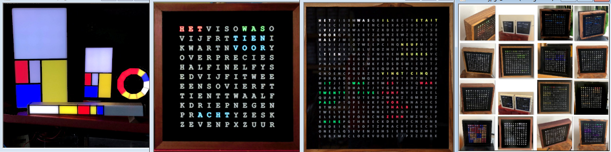

# Word Clock & Fibonacci Clock Selector

There are three different word clock designs, built with:

- A bare ATMEGA328 chip with white LEDs
- An Arduino Nano Every
- An Arduino Nano ESP32

The last two support WS2812 RGB and SK6812 RGBW LEDs. All designs support Bluetooth control, a rotary encoder as backup, a DS3231 RTC for accuracy (±20 s/year), and a LDR light sensor. The Nano ESP32 also supports a built-in web page and Wi-Fi/NTP time.

With spare RGB(W) LED-strip you can also build a **Fibonacci clock** — a constantly changing Mondriaan-style painting that displays time in three colours.

- [Fibonacci Mondriaan clock for ESP32-C3 and S3](https://github.com/ednieuw/Fibonacci-ESP32-C3-S3-Clock)
- [Fibonacci clock for Arduino Nano](https://github.com/ednieuw/Fibonacci-Vierkantekokerklok) (includes 3D-printable stick design)
- [Latest Fibonacci clock for Arduino Nano ESP32](https://github.com/ednieuw/Fibonacci-Nano-ESP32-clock)

The first word clock designs have been running for over 10 years. They use an 11×11 character grid, white 2835/3528 LED-strips, an ATMEGA328, and shift registers. Later designs moved to WS2812/SK6812 LED strips and an Arduino Nano (30×30 cm).

The four-language clock uses a 25×25 character grid. Because the French front plate required a 12×12 grid, all single-language faces were redesigned and expanded. These 12×12 clocks use an Arduino Nano Every or ATMEGA1280 with SK6812 or WS2812 strips, in standard sizes of 25×25 cm or 50×50 cm.

Since 2023, the Arduino Nano ESP32 (with onboard Wi-Fi and BLE) is used in the latest designs. Software supports English, German, French, and Dutch.

All clocks are [designed on PCBs](https://github.com/ednieuw/NanoESP32PCB) made with Fritzing (available as Fritzing and Gerber/ZIP files). Gerber files can be uploaded to a manufacturer like [PCBway](https://PCBWay.com). KiCad can also be used, though no conversion between KiCad and Fritzing formats is currently available.

---

## Build Options

- ATMEGA328 chip with shift registers and white LEDs
- Arduino Nano Every / ATMEGA1280 with WS2812 RGB or SK6812 RGBW LED-strips
- Arduino Nano ESP32 with WS2812 RGB or SK6812 RGBW LED-strips
- Arduino Nano ESP32 with shift registers and white LED-strips
- *Ultimate*: Arduino Nano ESP32 with shift registers + white LEDs + WS2812/SK6812 — all on one PCB

---

## Pros & Cons of Each Design

---

### [ATMEGA328 with shift registers and white LEDs](https://github.com/ednieuw/Woordklok-witte-LEDs)

**Pro**
- Proven sturdy design — zero failures across 40 clocks in over 10 years
- Can use a DCF77 time receiver

**Con**
- A lot of soldering (though a plus if you enjoy it)
- No Wi-Fi NTP time

**Options:** Replace the Bluetooth adapter with an [ESP32-C3 or S3](https://github.com/ednieuw/ESP32SerialNTP-BLE-Clock) to add Wi-Fi NTP, or use a [Nano ESP32 + HC12 transmitter](https://github.com/ednieuw/ESP32-HC12) to send time. Instructions are in Dutch — feel free to contact me for a translation.

---

### [Arduino Nano Every with WS2812 RGB or SK6812 RGBW LED-strips](https://github.com/ednieuw/Word-Colour-Clock-SK6812-WS2812)

**Pro**
- Full colour RGB(W) LEDs
- Solid design — zero failures across 40 clocks in over 5 years
- Easy to solder
- DCF77 works if receiver is kept 10–15 cm from the LEDs

**Con**
- No Wi-Fi NTP time

**Options:** Replace the Bluetooth adapter with an [ESP32-C3 or S3](https://github.com/ednieuw/ESP32SerialNTP-BLE-Clock) to add Wi-Fi NTP, or use a [Nano ESP32 + HC12 transmitter](https://github.com/ednieuw/ESP32-HC12) to send time.

---

### [Arduino Nano ESP32 with WS2812 RGB or SK6812 RGBW](https://github.com/ednieuw/Arduino-ESP32-Nano-Wordclock)

**Pro**
- Wi-Fi and BLE built in — control from phone or PC
- NTP time via internet + DS3231 RTC (works offline too)
- Software also runs on ESP32-C3/S3 and many other MCUs without a dedicated PCB — just wire up the LED-strip and DS3231

**Con**
- None identified

---

### [Arduino Nano ESP32 with shift registers and white LEDs](https://github.com/ednieuw/ESP32ShiftregisterBWclock)

**Pro**
- Wi-Fi and BLE built in — control from phone or PC
- NTP time via internet + DS3231 RTC (works offline too)

**Con**
- A lot of soldering (though a plus if you enjoy it)

---

### [Ultimate: Nano ESP32 — white LEDs + WS2812/SK6812 on one PCB](https://github.com/ednieuw/NanoESP32-BW-RGBW-clock)

**Pro**
- Wi-Fi and BLE built in — control from phone or PC
- NTP time via internet + DS3231 RTC (works offline too)
- One PCB that combines all capabilities of the designs above

**Con**
- A lot of soldering

---

*May 2026*
